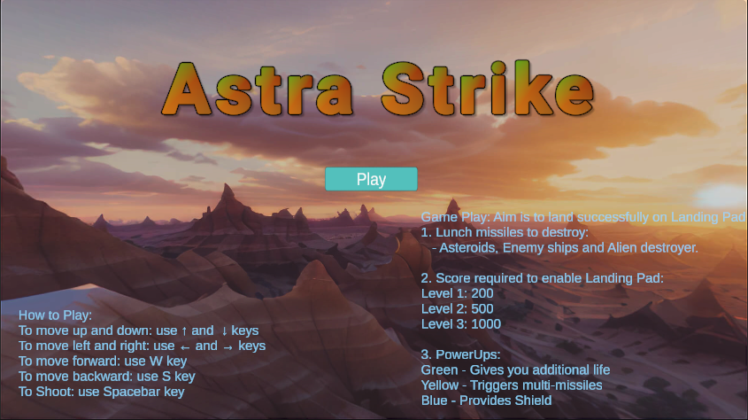
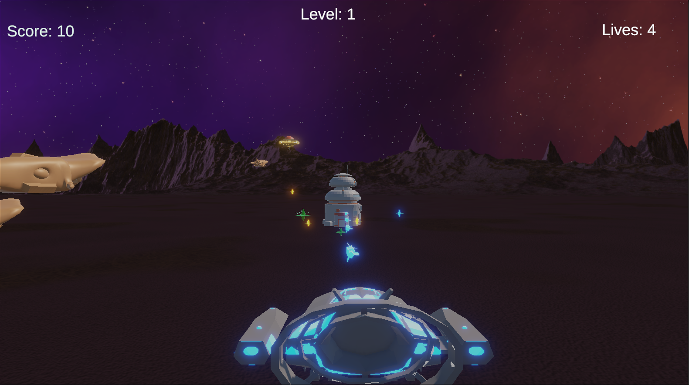
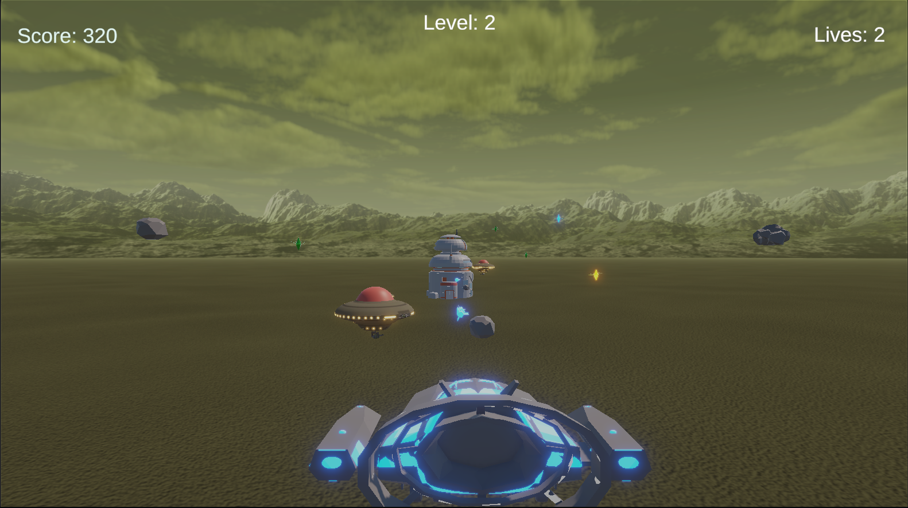
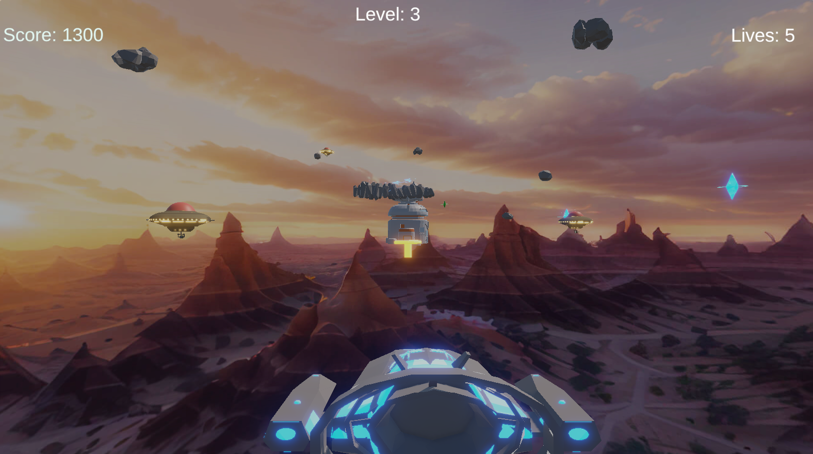
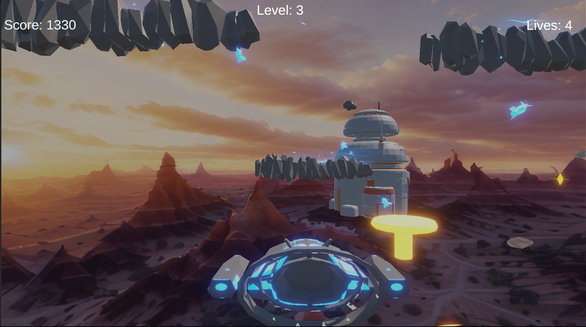
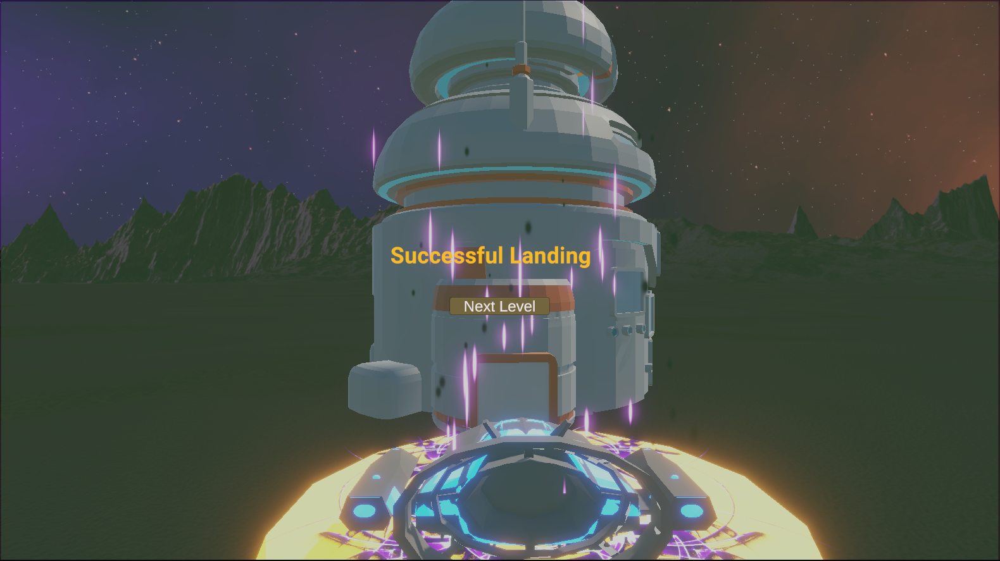
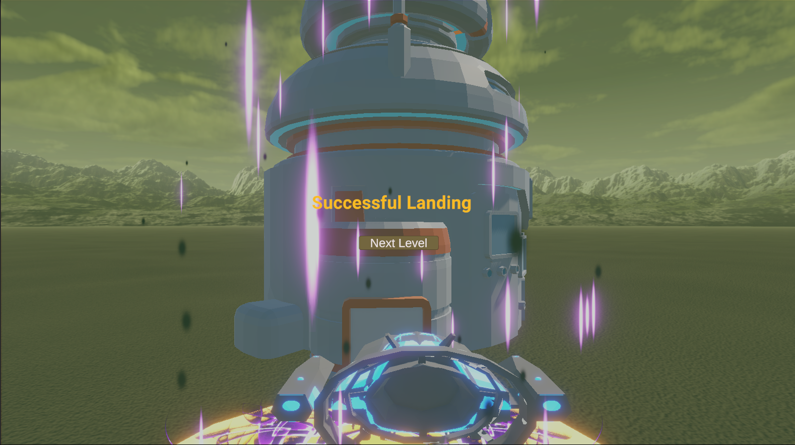
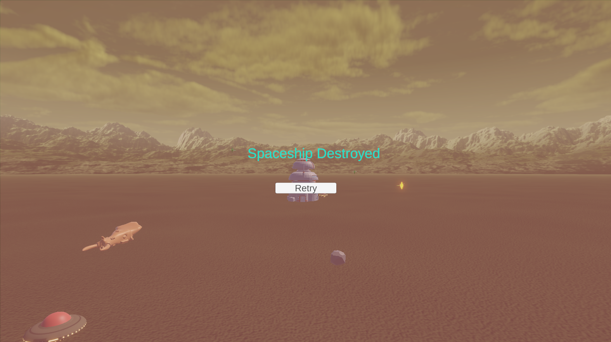
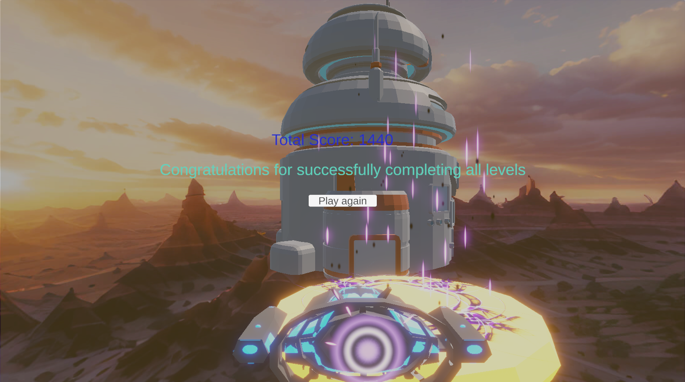

# 🚀 Astra Strike – SpaceShip Adventure

A 3D Unity Arcade Adventure Game where you pilot a spaceship from a launch pad, dodge and destroy Asteroids & Enemy Ships, collect Powerups and race to land on the Landing pad, after reaching target score for each level. Featuring level progression, HUD for Game play, score/lives/level management and fast-paced missile action!!!!

---

## 📸 Screenshots

---

## 🎮 Game Overview

- **Engine:** Unity (version 6.0+)
- **Genre:** 3D Space Arcade/Adventure
- **Gameplay Loop:** Launch, dodge, shoot, power up, target score, land!
- **Levels:** 3 story levels, each with unique landing score requirements (Landing pad displayed only after reaching required score)
- **HUD:** Score, level, and lives, all dynamically updated
- **Win Condition:** Achieve the score threshold at each level and land safely without being destroyed by Asteroids/Enemy Ships

---

## 🚀 Key Features

- **Spaceship Controls:**  
  - W/S: Move forward/backward  
  - Up/Down/Left/Right Arrows: Move Up/Down/left/right  
  - Spacebar: Shoot missiles
  - C : Switch camera view between Third-Person view and Pilot view  
- **Missiles & Powerups:**  
  - Collect Multi-Missile/Shield/Extra Life powerups
  - Multi-missile: launches homing missiles at all enemies in front
- **Landing Pad Unlock:**  
  - Pad appears only when you reach a score threshold (200/500/1000)

---

## 🛠️ Installation & Setup

1. **Clone this repo:**  

2. **Open in Unity:**  
- Unity version: *[6.0+]*
- Open the project folder in Unity Hub
3. **Build Settings:**  
- Scenes in Build:  
  - Main Menu (index 0)  
  - Level 1 (index 1)  
  - Level 2 (index 2)  
  - Level 3 (index 3)
- Set Level 1 as the start level in GameManager if needed
4. **Play & Enjoy:**  
- Press Play in the editor to start from Main Menu

---

## ✨ Project Structure

| Folder           | Purpose                                     |
| ---------------- | ------------------------------------------- |
| `Assets/Scripts` | All core gameplay logic and UI scripts      |
| `Assets/Scenes`  | Main Menu, Levels 1-3                       |
| `Assets/Prefabs` | Player, Asteroid/Asteroids/Enemyship/Alien Destroyer Ship, powerups, missile assets   |
| `Assets/Materials` | Visual styles and particle systems        |
| `Assets/Sound effects` | Sound systems        | Sound system
| `Assets/Paticle system` | Particle systems        | Particle systems

---

## 🧑‍💻 Core Scripts

- **GameManager.cs**: Singleton, tracks score, lives, HUD updates, and scene logic
- **UI-Manager.cs**: Manages Main Menu/HUD/Panels/game over overlays with fading and feedback
- **PlayerController.cs**: Keyboard input, shooting, and spaceship state
- **LandingPad.cs**: Handles logic when Spaceship successfully lands on Landing Pad and visual/particle/audio effects 
- **LandingPadGate.cs**: Hides/shows landing pad based on score/level rules
- **Powerup.cs**: Handles collection and grants powerup effects (e.g., multi-missile, Shield Powerup,...)
- **SpawnManager.cs**: Spawns asteroids/enemy ships/powerups on timer
- **Projectile.cs**: Shoots missiles at asteroids/enemy ships
- **HomingMissile.cs**: Seeks targets assigned by multi-missile effect
- **AudioAndParticle.cs**: Handles Audio and  Visual effects
- **CameraSwitcher.cs**: Handles Cinemachine camera switching between Third-person and Pilot views
- **EnemyMover.cs**: Handles Asteroids, Enemy ships and its states

---

## 🔥 Development Highlights

- **LandingPadGate logic:**  
Shows landing pad only when you reach the level-specific required score (200 for Level 1, 500 for Level 2, 1000 for Level 3)
- **MultiMissile Powerup:**  
Launches homing missiles at all enemies in front
- **Shield Powerup:**  
Protects Spaceship for 10 seconds against Asteroids/Enemy Ships
- **Particle and Audio:**  
Effects for actions, missile launches, powerups, and player events

---

## 🚥 Controls

| Action         | Key(s)      |
| -------------- | ----------- |
| Up/Down        | ↑/↓ Arrows  |
| Left/Right     | ←/→ Arrows  |
| Forward        | W Key       |
| Backward       | S Key       |
| Shoot Missile  | Spacebar    |

---

## 📝 TODO / Roadmap

- Add more levels with different appealing space environments
- Visual polish: VFX/SFX/skyboxes/ship skins and dedicated prefabs developments
- Refine Player controller and movements
- Include Boss fights and scoring tweaks

---

